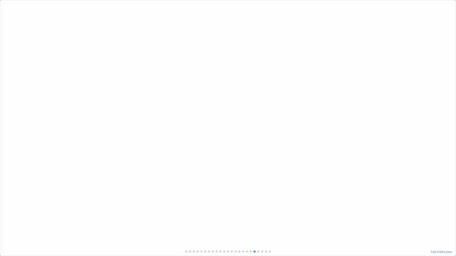

# marimo-banners

Composable slide presentations inside [marimo](https://marimo.io) notebooks.

Each slide is a Python object. Content is declared with dedicated classes and the layout adjusts automatically depending on what you pass.

> **Personal note:** This project is a personal initiative to explore the capabilities of generative AI for developing complete, production-quality software projects — from architecture decisions to implementation, testing, and documentation — using [Claude Code](https://claude.ai/code) as the primary development partner.

---

## 01 · Slide types & palettes


Four slide types (`Cover`, `Intro`, `Section`, `Closing`) with five built-in palettes (`ORANGE`, `BLUE`, `GREEN`, `PURPLE`, `GRAY`) and full custom palette support.

---

## 02 · Content types


`Text` (markdown + LaTeX), `Image`, `Graph` (Mermaid), `AnimatedGraph` (interactive), `Table`, `Plot` (matplotlib / plotly), `FlowAnimation`, and `Manim` — all composable inside any slide.

---

## 03 · Slide backgrounds



`Background.color()`, `Background.gradient()`, and `Background.image()` — apply to any slide. Dark overlays and text contrast are handled automatically.

---

# Installation

```bash
uv pip install marimo-banners
```

For animated diagrams (`FlowAnimation`, `Manim`):

```bash
uv pip install "marimo-banners[manim]"
```

`FlowAnimation` and `Manim` depend on system libraries for text rendering:

```bash
sudo apt install python3-dev libpango1.0-dev pkg-config
```

# Quick start

```python
from banners import configure, Background
from banners.slides import Cover, Intro, Section, Closing
from banners.content import Text, Image, Graph
from banners.palette import BLUE

# Set shared values once — all slides inherit them automatically.
configure(
    team="Analytics Team",
    date="April 2026",
    palette=BLUE,
    icon={"src": "img/logo.png"},
)

Cover(
    title="Churn Prediction v2",
    subtitle="Model migration and deployment.",
    content=[
        Text("**Accuracy** — 91% AUC on holdout."),
        Text("**Latency** — p99 under 30 ms."),
        Text("**Coverage** — All active segments."),
    ],
    content_kind="neutral",
).render()
```

# Global configuration

`configure()` sets values shared across all slides. Call it once at the top of the notebook.

| Parameter | Used by | Description |
|-----------|---------|-------------|
| `team` | `Cover`, `Intro`, `Closing` | Label shown in the banner |
| `date` | `Cover` | Date line at the bottom of the banner |
| `palette` | `Cover`, `Intro`, `Closing` | Color palette (`BLUE`, `GREEN`, etc.) |
| `icon` | All slides | Logo/icon placed on the banner |

Calling `configure()` also resets the `Section` auto-number counter to zero.

Any slide parameter passed explicitly overrides the global value.

# Slides

| Class | Purpose | Typical position |
|-------|---------|-----------------|
| `Cover` | Large centered banner | First slide |
| `Intro` | Context or problem statement | Slides 2–3 |
| `Section` | Intermediate slide with left border | Middle slides |
| `Closing` | Closing banner with optional metrics | Last slide |

All slides share these parameters:

| Parameter | Description |
|-----------|-------------|
| `title` | Main heading |
| `subtitle` | Support phrase shown inside the banner |
| `content` | Content element(s) displayed below the banner |
| `palette` | Color palette. Defaults to orange |
| `content_kind` | Box style for `Text` lists: `neutral`, `info`, `success`, `warn`, `danger` |
| `footer` | Quote rendered as a blockquote at the bottom of the slide |
| `icon` | Banner icon. Falls back to the global `configure()` value |
| `background` | Custom slide background (see [Slide backgrounds](#slide-backgrounds)) |

## Section — auto-numbering

`Section` slides assign their number automatically, starting from `01` and incrementing with each new instance. The counter resets when `configure()` is called.

```python
configure(team="My Team")    # counter resets to 0

Section(title="Context")     # number = "01"
Section(title="Results")     # number = "02"
Section(title="Conclusions") # number = "03"

# Override:
Section(title="Appendix", number="A1")

# Suppress:
Section(title="No number", number="")
```

# Content elements

| Class | Renders |
|-------|---------|
| `Text(body)` | Markdown — paragraphs, lists, tables, LaTeX |
| `Image(src)` | Image from file path, bytes, or URL |
| `Graph(code)` | Static Mermaid diagram |
| `AnimatedGraph(code)` | Interactive Mermaid diagram — click to highlight nodes |
| `Table(df)` | pandas DataFrame |
| `Plot(fig)` | matplotlib or plotly figure (auto-detected) |
| `FlowAnimation(...)` | Click-to-advance animated pipeline diagram |
| `Manim(scene)` | Custom Manim `Scene` subclass (static or interactive) |

Content is passed to the `content` parameter of any slide. Layout is resolved automatically:

- **Single item** → full width.
- **List of `Text` only** → equal columns; pass `content_kind` to add a styled box.
- **List with any other element** → equal-width CSS grid, one column per item.

## AnimatedGraph

Accepts `graph LR` / `graph TD` Mermaid syntax. Clicking a node toggles a highlight color.

```python
from banners.content import AnimatedGraph

AnimatedGraph("""
graph LR
    A[Ingest] --> B[Validate]
    B --> C[Transform]
    C --> D[Load]
""", highlight_color="#3b82f6")
```

## FlowAnimation

Step-by-step pipeline animation. Each node appears on click. Requires the `manim` dependency.

```python
from banners.content import FlowAnimation

# Flat list — linear chain
FlowAnimation(["S3", "Glue", "Athena"])

# Nested list — layered topology
FlowAnimation([
    ["Ingest"],
    [{"name": "Transform A", "detail": "features"},
     {"name": "Transform B", "detail": "filters"}],
    ["Load"],
])

# Explicit graph — arbitrary connections
FlowAnimation(
    nodes=["Ingest A", "Ingest B", "Validate", "Train"],
    edges=[
        ("Ingest A", "Validate"),
        ("Ingest B", "Validate"),
        ("Validate", "Train"),
    ],
)
```

| Parameter | Default | Description |
|-----------|---------|-------------|
| `direction` | `"LR"` / `"TD"` | Flow direction — left-right or top-down |
| `quality` | `"low"` | Render quality: `"low"`, `"medium"`, `"high"` |
| `width` | `"100%"` | Player width — any CSS value |

Default direction: `"LR"` for flat lists and graphs, `"TD"` for nested lists.

## Manim

Embed any Manim `Scene` subclass — static GIF/PNG/MP4 or click-to-advance interactive mode.

```python
from manim import Scene, MathTex, Write
from banners.content import Manim

class MyScene(Scene):
    def construct(self):
        self.camera.background_color = "#0f172a"
        self.next_section("eq1")
        self.play(Write(MathTex(r"E = mc^2", font_size=72)))
        self.wait(1)
        self.next_section("eq2")
        self.play(Write(MathTex(r"\nabla^2 E = \frac{1}{c^2}\ddot{E}", font_size=52)))
        self.wait(1)

Section(
    title="Derivation",
    content=[Manim(MyScene, interactive=True, quality="medium")],
).render()
```

Renders are cached on disk (`~/.cache/banners/manim/`) keyed by scene source code — no re-rendering across notebook restarts.

# Palettes

All slides accept a `palette` parameter. The default is orange.

| Constant | Colors |
|----------|--------|
| `ORANGE` | `#7c2d12` → `#c2410c` → `#ea580c` |
| `BLUE` | `#1e3a5f` → `#1d4ed8` → `#3b82f6` |
| `GREEN` | `#14532d` → `#15803d` → `#22c55e` |
| `PURPLE` | `#3b0764` → `#7e22ce` → `#a855f7` |
| `GRAY` | `#111827` → `#374151` → `#6b7280` |

Custom palettes: `Palette(start, mid, end)` for full-banner slides, `SectionPalette(border, bg_start, bg_end)` for `Section`.

# Slide backgrounds

The `background` parameter paints the full slide area (banner + content) with a custom background. Use the `Background` factory class:

```python
from banners import Background

# Solid color
Cover(title="Dark slide", background=Background.color("#0f172a"))

# Custom gradient
Section(title="Gradient", background=Background.gradient("#0d1b2a", "#4a1a6e"))
Section(title="3-stop",   background=Background.gradient("#0d1b2a", "#4a1a6e",
                                                        mid="#1a2a5e", angle=45))

# Image — dark overlay applied automatically for legibility
Cover(title="Photo", background=Background.image("assets/photo.jpg"))
Cover(title="URL",   background=Background.image("https://...", overlay="rgba(0,0,0,0.7)"))
Cover(title="Raw",   background=Background.image(raw_bytes, overlay=None))
```

When `background` is set and `content_kind` is not, the content text color is chosen automatically based on the background luminance. Passing `content_kind` explicitly disables this.

# Documentation

```bash
make docs
```

Generated HTML is written to `docs/`.

# Examples

| Notebook | Content |
|----------|---------|
| `example/showcase.py` | Full capabilities walkthrough — all slide types, content elements, and backgrounds |
| `example/ondas_electromagneticas.py` | Complete presentation: Maxwell's equations → animated derivation → wave solution |

Run any example with:

```bash
uv run marimo edit example/showcase.py
```
